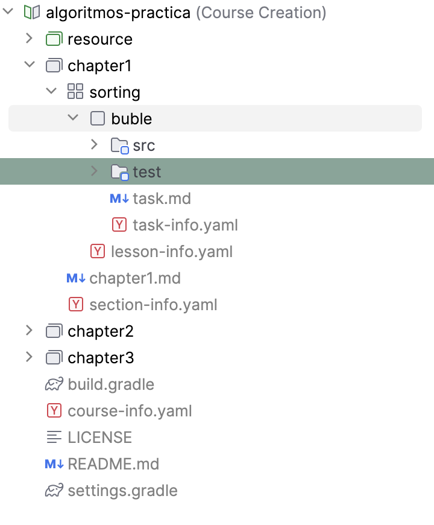

# Algorithms Course Notes

## Attribution

These notes synthesize materials from:

### Primary Source

**University of Cambridge Algorithms Course**  
Taught by [Professor Frank Stajano](http://frankstajanoexplains.com)  
© 2005–2021 Frank Stajano

- [Lecture Recordings](http://frankstajanoexplains.com)
- [Course Website](https://www.cl.cam.ac.uk/teaching/2021/Algorithms/)

### Supplementary Sources

**CC3001 Course Notes** (Java version)  
By Patricio Poblete and Benjamín Bustos  
Universidad de Chile, Department of Computer Science

- 🔗 [Course Materials](http://www.dcc.uchile.cl/cc3001/) (general reference)

---

## License Structure

### For Derived Content

My adapted notes are shared under:  
[CC BY-NC-SA 4.0](https://creativecommons.org/licenses/by-nc-sa/4.0/)  
Attribution-NonCommercial-ShareAlike 4.0 International

## Content Overview

1. Fundamental algorithms & complexity
2. Sorting/searching techniques
   (InsertSort, MergeSort, QuickSort)
3. Dynamic programming
   (Rod cutting, Matrix chains, LCS)
4. Graph algorithms
   (Dijkstra's, Bellman-Ford)
5. Advanced data structures
   (BSTs, Red-Black Trees, Fibonacci Heaps)

See [SYLLABUS.md](SYLLABUS.md) for detailed schedule.

## InteliJ Setup

1. Open the project in IntelliJ
2. In the project comboBox type, select "Course"
3. And that's it!

---

  <i>"Good algorithms are the poetry of computation"</i> — F.S. & P.P.

