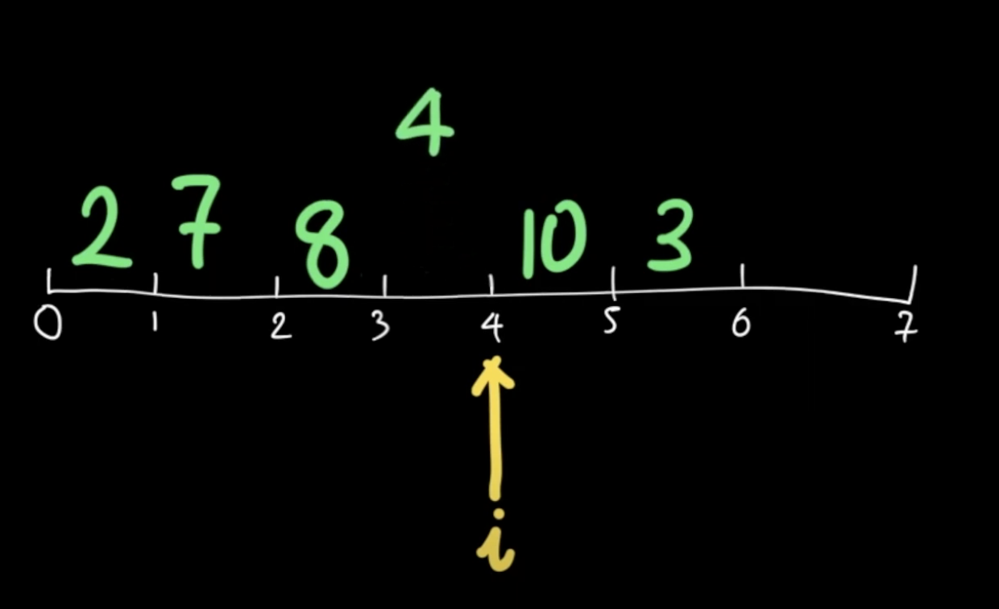
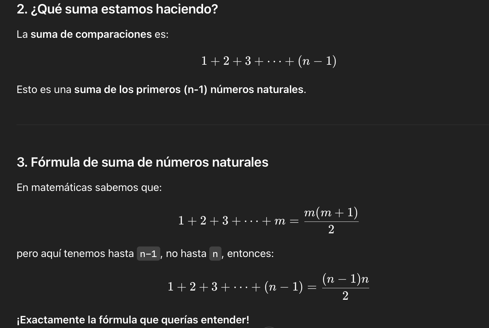
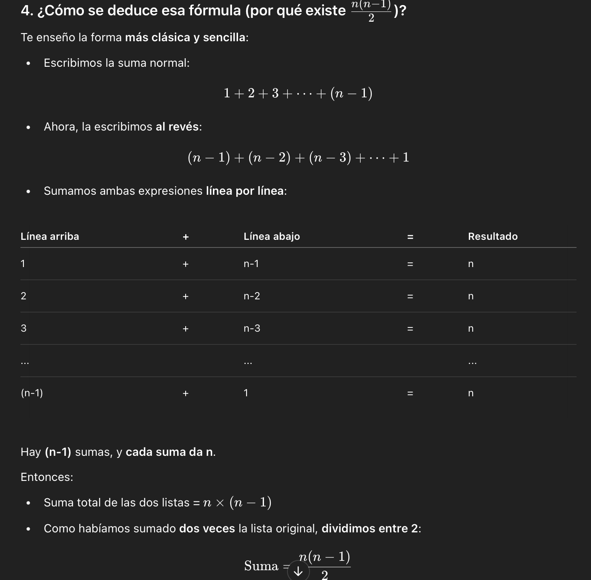
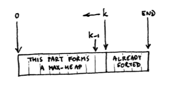
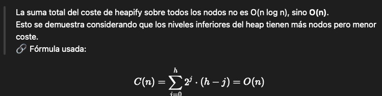

# Chapter 2: Sorting

## Insertsort 

It simulates how we sort cards in our hand.
We assume we have an array a[] of size n.
For each element a[i], it is inserted in the correct position within the subarray a[0:i], shifting elements to the right as needed.

### Pseudocode implementation with two loops:

- One loop to advance i.
- Another to compare and swap a[j] with a[j+1] if necessary.
  **Outer loop invariant:** The first i elements are already sorted.
  **Improvement:** The number of assignments can be reduced by temporarily storing a[i] and performing only shifts until the correct position is found.

Then the difference between two indices gives you the number of cells between them. So for example the subarray a[2:5], containing the elements from a[2] included to a[5] excluded, has 5−2 = 3 elements, namely a[2] = "F", a[3] = "E" and a[4] = "A".


Imagine you are playing cards and you have to sort them in your hand.
- You take the first card and put it in your hand.
- You take the next card and put it in the right place, comparing it with the ones you already have.
- Repeat this with all the cards.

The same thing **insertsort** does with an array of numbers.

<div style="text-align: center;">
  
</div>

**How does it work?**
Suppose you have this arrangement:

[8, 3, 5, 1]

**Step by step:**
- You start from the second element (3) and compare it with the previous one (8).
- Since 3 < 8, you swap them.
- It looks like this: [3, 8, 5, 1]

*Then you take the 5:*
- You compare it with 8 → you interchange it.
- Then with 3 → you do not interchange.
- Result: [3, 5, 8, 1]

*Then the 1:*
- You compare it with 8, 5, and 3, swapping back to the beginning.
- End result: [1, 3, 5, 8]

**Code in pseudocode:**

```java
for i = 1 to n-1:
    j = i - 1
    while j >= 0 and a[j] > a[j+1]:
        swap(a[j], a[j+1])
        j = j - 1
```

```java
public static void insertSort(int[] a) {
    int n = a.length;
    
    for (int i = 1; i < n; i++) {
        int key = a[i]; // el valor a insertar
        int j = i - 1;

        // Mueve los elementos mayores que key hacia la derecha
        while (j >= 0 && a[j] > key) {
            a[j + 1] = a[j];
            j--;
        }

        // Inserta el valor en la posición correcta
        a[j + 1] = key;
    }
}
```

**Complete example to understand:**
[8, 3, 5, 1]
1. i = 1 (element 3)
    * j = 0 (element 8)
    * ¿8 > 3? Yes → swap(8, 3) Result: [3, 8, 5, 1]
    * j = -1 → End while.
2. i = 2 (element 5)
    * j = 1 (element 8)
    * ¿8 > 5? Yes → swap(8, 5) Result: [3, 5, 8, 1]
    * j = 0 (element 3)
    * ¿3 > 5? No → End while.
3. i = 3 (element 1)
    * j = 2 (element 8)
    * ¿8 > 1? Yes → swap(8, 1) Result: [3, 5, 1, 8]
    * j = 1 (element 5)
    * ¿5 > 1? Yes → swap(5, 1) Result: [3, 1, 5, 8]
    * j = 0 (element 3)
    * ¿3 > 1? Yes → swap(3, 1) Result: [1, 3, 5, 8]
    * j = -1 → End while.

Cada vez que haces swap(x, y), haces 3 asignaciones:
- tmp = x;
- x = y;
- y = tmp;

### Is the algorithm correct?

Stating objectives using **preconditions** and **postconditions** helps validate correctness.
The use of **invariants** (statements that always hold true at a certain point in the code) is essential.
**Mathematical induction** can be used: prove the base case and the inductive step.

## Computational Complexity

### Abstract modeling and growth rates

The following assumptions are made to analyze cost:
- We only care about the **worst case**.
- Constants are ignored; **asymptotic growth** is what matters.
- It doesn’t matter if the estimation fails for small input sizes.
- The analysis is done **abstractly**, without physical limitations.

### Notations O, Θ, and Ω- **Big-O (O):

**
Upper bound.
f(n) ∈ O(g(n)) ⇔ ∃k, N > 0 : ∀n > N, 0 ≤ f(n) ≤ k·g(n)
*“f grows at most like g”*
    - **Insertsort** en el peor caso compara cada número con todos los anteriores → eso son **n² operaciones**.
- **Theta (Θ):**
Tight bound (both upper and lower).
f(n) ∈ Θ(g(n)) ⇔ ∃k₁, k₂, N > 0 : ∀n > N, k₁·g(n) ≤ f(n) ≤ k₂·g(n)
*“f grows exactly like g”*
    - Si InsertSort **siempre** necesita aproximadamente n² pasos (ni mucho más ni mucho menos), entonces: → InsertSort es Θ(n²)
- **Omega (Ω):**
Lower bound.
*“f grows at least like g”*
    - Si InsertSort recibe un arreglo ya ordenado, solo compara una vez por elemento.
    - Entonces es **lineal**:
→ InsertSort es Ω(n)


| Notation   | What it measures   | How to think about it |
|------------|--------------------|-----------------------|
| O()        | Maximum growth     | Up to this limit      |
| Θ()        | Exact growth       | Equal to this         |
| Ω()        | Minimal growth     | At least this         |


| If... then     | f(n) grows ... g(n).       | f(n) ... g(n)  |
|----------------|----------------------------|----------------|
| f(n) ∈ o(g(n)) | strictly more slowly than  | <              |
| f(n) ∈ O(g(n)) | at most as quickly as      | ≤              |
| f(n) ∈ Θ(g(n)) | exactly like               | =              |
| f(n) ∈ Ω(g(n)) | at least as quickly        | ≥              |
| f(n) ∈ ω(g(n)) | strictly more quickly than | >              |


When we want to calculate **how long an algorithm takes**, we make assumptions so as not to overcomplicate it:
- We only care about the worst case (the scenario where the algorithm takes the longest).
- We ignore constants: if it takes 10n or 0.0001n operations, we say it is simply O(n).
- It does not matter if for small values it behaves differently: we are interested for large n.
- We do not apply reality constraints: we analyze theoretically, as if everything were infinite.

**Common errors that we correct in the text:**
Saying that  ***f(n)=O(g(n))*** is technically incorrect (but everyone says so in practice).
Formally it should be  ***f(n)***∈***O(g(n)).***

**Function value vs. cost of computing it:**
- A value may be large (like n!), but computing it may be cheap (O(n)).

**Memory models:**
- They assume that accessing any position in an array takes the same time.
- This is not 100% true in real life (e.g., if there are cache misses on modern processors), but is simplified to be able to analyze algorithms easier.

**Arithmetic models:**
- They assume that adding, subtracting, or multiplying takes a single step.
- They do not consider huge numbers that do not fit in a normal variable (although in theory they could exist).

> **NOTA:** Para arrays de **primitivos** (como int[]), internamente Java usa una mezcla de **Dual-Pivot Quicksort** (un tipo de Quicksort más rápido).
> Para arrays de **objetos** (como Integer[], String[]), usa **TimSort** (una combinación optimizada de MergeSort e InsertSort).

### Practice
**Exercise 1**
Assume that each swap(x, y) means three assignments (namely tmp = x; x = y; y = tmp). Improve the insertsort algorithm pseudocode shown in the hand- out to reduce the number of assignments performed in the inner loop.

**Solución:**
La versión clásica de InsertSort realiza muchos intercambios (swaps) mientras el elemento a insertar “baja” en el array. En vez de hacer eso, podemos **mover los elementos hacia la derecha** y luego colocar el valor directamente en su lugar final. Esto evita múltiples swaps innecesarios.

**Versión optimizada:**

```
for (int i = 1; i < n; i++) {
    int key = A[i];
    int j = i - 1;
    while (j >= 0 && A[j] > key) {
        A[j + 1] = A[j]; // una sola asignación por iteración
        j--;
    }
    A[j + 1] = key; // solo una asignación final
}
```
**Ventaja:** En lugar de 3 asignaciones por swap, solo se hacen una por movimiento, y una final para insertar la clave.

**Exercise 2**
Provide a useful invariant for the inner loop of insertsort, in the form of an assertion to be inserted between the “while” line and the “swap” line.
Un invariante es una condición que se mantiene verdadera en cada iteración del bucle.

**Invariante útil:**
En cada iteración del bucle interno, los elementos A[0..j] están ordenados y cada uno es mayor que key.
**Colocación en pseudocódigo:**

```java
while (j >= 0 && A[j] > key) {
    // Invariante: A[0..j] está ordenado y A[j] > key
    A[j + 1] = A[j];
    j--;
}
```


**Exercise 3**
Write down an incorrect definition for o(n) by taking the definition of O(n) and replacing ≤by <. Then find values for k and N that, by this definition, would allow us to claim that f (3n2) ∈o(n2).

**Definición incorrecta:**
f(n) ∈ o(g(n)) ⇔ ∃ k > 0, N > 0 : ∀ n > N, f(n) < k·g(n)
Esto es incorrecto porque o(g(n)) significa que **f crece estrictamente más lento que g**, lo cual implica:
lim (f(n)/g(n)) = 0
**Ejemplo:**
Sea f(n) = 3n² y g(n) = n²
Usando la definición incorrecta:
- Tomemos k = 4, entonces: 3n² < 4n² ⇒ se cumple para todo n > 0
- Esto diría (erróneamente) que 3n² ∈ o(n²)
  **Pero esto es falso**, ya que:
lim (3n² / n²) = 3 ≠ 0 → por tanto, **no está en o(n²)**


**Exercise 4**

```
sin(n)|= O(1)
|sin(n)| ̸= Θ(1)
200 + sin(n) = Θ(1)
123456n + 654321 = Θ(n)
2n−7 = O(17n2)
lg(n) = O(n)
lg(n) ̸= Θ(n)
n100
= O(2n)
1 + 100/n = Θ(1)
```

For each of the above “=” lines, identify the constants k, k1, k2, N as appropriate.
For each of the “̸=” lines, show they can’t possibly exist.

**|sin(n)| = O(1)**
✔️ Verdadero.
- |sin(n)| ≤ 1, ∀n
- k = 1, N = 1
  **|sin(n)| ≠ Θ(1)**
✔️ Verdadero.
- No hay constantes **k₁, k₂** tal que k₁ ≤ |sin(n)| ≤ k₂ ∀n > N, porque |sin(n)| se acerca arbitrariamente a 0.
  **200 + sin(n) = Θ(1)**
✔️ Verdadero.
- Oscila entre 199 y 201 → acotado.
- k₁ = 199, k₂ = 201, N = 1
  **123456n + 654321 = Θ(n)**
✔️ Verdadero.
- Término dominante es lineal.
- k₁ = 123456, k₂ = 123456 + ε (por ejemplo 130000), N suficientemente grande.
  **2n−7 = O(17n²)**
✔️ Verdadero.
- 2n−7 ≤ 2n ≤ 17n² para n suficientemente grande.
- k = 1, N = 2
  **lg(n) = O(n)**
✔️ Verdadero.
- log(n) crece más lento que n.
  **lg(n) ≠ Θ(n)**
✔️ Verdadero.
- No hay k₁, k₂ tales que k₁·n ≤ log(n) ≤ k₂·n. log(n)/n → 0
  **n¹⁰⁰ = O(2ⁿ)**
✔️ Verdadero.
- Toda función polinomial es O(exponencial).
  **1 + 100/n = Θ(1)**
✔️ Verdadero.
- tiende a 1 cuando n → ∞, por tanto está acotada.


**Exercise 5**
What is the asymptotic complexity of the variant of insertsort that does fewer
swaps?

La complejidad asintótica **en tiempo sigue siendo O(n²)** en el peor caso, porque las comparaciones siguen siendo cuadráticas.
**Pero la cantidad de asignaciones mejora**:
- Clásico: hasta 3n² asignaciones
- Optimizado: solo n² comparaciones + n asignaciones finales.

**Exercise 6**
The proof of Assertion 1 (lower bound on exchanges) convinces us that Θ(n) exchanges are always su<span style="font-family:HelveticaNeue;">fficient. But why isn’t that argument good enough to prove that they are also necessary

Porque **"suficientes" no implica "necesarios"**.
El argumento muestra que en el **mejor de los casos** con buena implementación se pueden usar solo Θ(n) intercambios.
Pero **no excluye** que en otros casos (peores entradas o algoritmos menos eficientes) se puedan necesitar más.
Para probar necesidad, se requeriría demostrar que **todas** las implementaciones **en todos los casos** no pueden hacer menos que Θ(n), lo cual no se ha hecho.

### Models of memory

What does the course assume about memory?

When we analyze algorithms in the course, we make a very simple assumption to keep it simple:

- We imagine that we have as much memory as we want.
- We assume that we can access any position in an array in constant time (that is, fast, regardless of whether the array is large).

*In reality, computers have limits:*
- If the number is too large, we need more bits to represent it (e.g., more than 32 bits).
- If RAM is not enough, you can't have giant arrays.

Worst, Average, and Amortized Costs
Analyzing InsertSort
🔴 Worst case of InsertSort:The worst case occurs if the array is in reverse order (totally messed up). Every time you insert a new number, you have to compare and move it almost with all the previous ones. Then InsertSort does approximately:

<div style="text-align: center;">
  
</div>


That is O(n²) → Quadratic growth.

🟢 Best case of InsertSort:If the array is already sorted, it only does one comparison per element. Then it would be O(n).

## Selectionsort

What is SelectionSort?Another simple sorting algorithm:
- Finds the smallest element in the array.
- It places it in the first position.
- Then it finds the next smallest for the second position.
- And so on until it sorts everything.

Step by step:1. Find the minimum in the whole array.
2. Swap it with the first element.
3. Find the minimum in the rest.
4. Swap it with the second element. And so on.

SelectionSort cost:Always does the same number of comparisons, no matter if the array is already sorted.

<div style="text-align: center;">
  
</div>


O(n²) in all cases.

```java
public static void selectionSort(int[] a) {
    for (int i = 0; i < a.length - 1; i++) {
        int minIndex = i;
        for (int j = i + 1; j < a.length; j++) {
            if (a[j] < a[minIndex]) {
                minIndex = j;
            }
        }
        // swap
        int temp = a[i];
        a[i] = a[minIndex];
        a[minIndex] = temp;
    }
}
```

**Ejemplo paso a paso**
Supongamos que tenemos:
- int[] a = {5, 3, 8, 1};

**Iteraciones:**

| i  | Acción                        | Resultado    |
|----|-------------------------------|--------------|
| 0  | Buscar mínimo (1), swap con 5 | [1, 3, 8, 5] |
| 1  | Buscar mínimo (3) → ya está   | [1, 3, 8, 5] |
| 2  | Buscar mínimo (5), swap con 8 | [1, 3, 5, 8] |

## How does insertsort compare to selectionsort?Quick comparison:

| Algoritmo     | Comparaciones  | Intercambios (swaps)                                        |
|---------------|----------------|-------------------------------------------------------------|
| InsertSort    | O(n²)          | O(n²) en peor caso, pero puede ser muy rápido en mejor caso |
| SelectionSort | O(n²)          | Siempre O(n) intercambios                                   |


✅ InsertSort is best if the array is nearly sorted.
✅ SelectionSort is more predictable but dumber (does not adapt to already sorted data).


**1. ¿Qué pasa en cada ciclo?**
**Para InsertSort:**
- En el primer paso (i = 1), comparas con 1 elemento.
- En el segundo paso (i = 2), comparas con 2 elementos.
- En el tercero (i = 3), comparas con 3 elementos.
- ...
- En el último (i = n-1), comparas con n-1 elementos.

**Para SelectionSort:**
- En la primera pasada, comparas n-1 veces para encontrar el mínimo.
- En la segunda pasada, n-2 veces.
- Y así sucesivamente, hasta comparar solo 1 vez en la últim

<div style="text-align: center;">
  
</div>

<div style="text-align: center;">
  
</div>

## Binary InsertSortIt is a variant of the InsertSort algorithm, but optimizes the search for the place to insert the element using binary search instead of a linear search.


<p style="text-align:right;margin:0">The complete sorting process performs this process for k from 1 to n, and hence the
total number of comparisons performed will be <span style="font-family:Menlo-Italic;"><i>⌈</i><i>lg(1)</i><span style="font-family:Menlo-Italic;"><i>⌉</i><i>+</i> <span style="font-family:Menlo-Italic;"><i>⌈</i><i>lg(2)</i><span style="font-family:Menlo-Italic;"><i>⌉</i><i>+...+</i> <span style="font-family:Menlo-Italic;"><i>⌈</i><i>lg(n−1)</i><span style="font-family:Menlo-Italic;"><i>⌉</i> which is bounded by <i>lg(1) + 1 + lg(2) + 1 +...+ lg(n−1) + 1</i> and thus by <i>lg((n−1)! ) + n = O(lg(n! )) = O(nlg n).</i>
</p>

- Saves comparisons, but not moves.
- Worst-case complexity remains O(n²).

**Step-by-step of the algorithm:**
1. We traverse from the second element (i = 1 to n-1).
2. For each A[i], we use binary search on the subarray A[0...i-1] to find the pos position where to insert it.
3. We shift the elements to the right (A[pos...i-1]) to make space.
4. We insert A[i] in A[pos].


| Aspecto               | Coste      |
|-----------------------|------------|
| Comparaciones         | O(n log n) |
| Movimientos           | O(n²)      |
| Mejor caso (ordenado) | O(n log n) |
| Estable               | Sí         |
| In-place              | Sí         |


```java
public class BinaryInsertSort {
    public static void sort(int[] arr) {
        for (int i = 1; i < arr.length; i++) {
            int key = arr[i];
            int left = 0, right = i - 1;

            // Binary search for insertion point
            while (left <= right) {
                int mid = (left + right) / 2;
                if (arr[mid] > key) right = mid - 1;
                else left = mid + 1;
            }

            // Shift elements to the right
            for (int j = i - 1; j >= left; j--) {
                arr[j + 1] = arr[j];
            }

            arr[left] = key;
        }
    }
}
```

## Bubblesort

What is Bubblesort?

- It compares pairs of adjacent elements.
- If they are in the wrong order, it swaps them.
- Thus the larger element “floats” to the end of the array (like a bubble).

Step by step:1. Compare first and second element, swap if necessary.
2. Compare second and third, swap if necessary.
3. Repeat until the end.
4. Start over, ignoring the last one (it is already in place).

Bubblesort cost:- Comparisons ≈ O(n²).
- Best case (already sorted): can be optimized to O(n).

Java code:
```
public static void bubbleSort(int[] a) {
    boolean swapped;
    int n = a.length;
    do {
        swapped = false;
        for (int i = 0; i < n - 1; i++) {
            if (a[i] > a[i + 1]) {
                // swap
                int temp = a[i];
                a[i] = a[i + 1];
                a[i + 1] = temp;
                swapped = true;
            }
        }
        n--; // optimización: no revisar la última posición ya ordenada
    } while (swapped);
}
```

Ejemplo paso a pasoCon:
- int[] a = {5, 3, 8, 1};

**Iteraciones:**
- Primera pasada:
    - 5 > 3 → swap → [3, 5, 8, 1]
    - 5 > 8 → no
    - 8 > 1 → swap → [3, 5, 1, 8]
- Segunda pasada:
    - 3 > 5 → no
    - 5 > 1 → swap → [3, 1, 5, 8]
- Tercera pasada:
    - 3 > 1 → swap → [1, 3, 5, 8]
- Cuarta pasada:
    - No swaps → terminado
      🎯 ¡Ordenado!


## How does bubblesort compare to insertsort?
| Algoritmo  | Mejor caso  | Peor caso  |
|------------|-------------|------------|
| InsertSort | O(n)        | O(n²)      |
| Bubblesort | O(n)        | O(n²)      |


✅ Both are O(n²) in general.
✅ InsertSort tends to be faster because it makes fewer unnecessary swaps.


## MergesortWhat is Mergesort?

- A much more efficient algorithm based on the “divide and conquer” principle.

How it works:- Divide the array into two halves.
- Sort each half recursively.
- Mix (merge) the two sorted halves into a single sorted list.

Step by step:1. Suppose a = [8, 3, 5, 1]:
2. Divide: [8, 3] and [5, 1].
3. Order each half:
   [8, 3] → [3, 8]
   [5, 1] → [1, 5]
   Blend:
   [3, 8] y [1, 5] → [1, 3, 5, 8]

Mergesort cost:- Always does O(n log n) operations.
- Much faster than O(n²) for large arrays.


```java
public static void mergeSort(int[] a, int left, int right) {
    if (left < right) {
        int mid = (left + right) / 2;
        mergeSort(a, left, mid);
        mergeSort(a, mid + 1, right);
        merge(a, left, mid, right);
    }
}

public static void merge(int[] a, int left, int mid, int right) {
    int n1 = mid - left + 1;
    int n2 = right - mid;

    int[] L = new int[n1];
    int[] R = new int[n2];

    for (int i = 0; i < n1; i++) L[i] = a[left + i];
    for (int j = 0; j < n2; j++) R[j] = a[mid + 1 + j];

    int i = 0, j = 0, k = left;
    while (i < n1 && j < n2) {
        if (L[i] <= R[j]) {
            a[k++] = L[i++];
        } else {
            a[k++] = R[j++];
        }
    }

    while (i < n1) a[k++] = L[i++];
    while (j < n2) a[k++] = R[j++];
}

-- Y en main():

int[] arr = {5, 4, 3, 2, 1};
mergeSort(arr, 0, arr.length - 1);
```

**Ejemplo paso a paso**
**Con:**
- int[] a = {5, 3, 8, 1};
- mergeSort(a, 0, a.length - 1);

**Iteraciones:**
- Divide en dos: [5, 3] y [8, 1]
- Ordena [5, 3] → [3, 5]
- Ordena [8, 1] → [1, 8]
- **Merge**:
    - Comparar 3 y 1 → poner 1
    - Comparar 3 y 8 → poner 3
    - Comparar 5 y 8 → poner 5
    - Solo queda 8 → poner 8
      🎯 Resultado: [1, 3, 5, 8]


### Practice
**Exercise 7**
When looking for the minimum of m items, every time one of the m−1 comparisons fails the best-so-far minimum must be
updated. Give a permutation of the numbers from 1 to 7 that, if fed to the selectsort algorithm, maximizes the number of times that the above-mentioned comparison fails.

**Respuesta y explicación:**
SelectionSort siempre selecciona el mínimo en cada paso. Para que la variable "mínimo" se actualice muchas veces, cada nuevo elemento debe ser menor que todos los anteriores.
Esto sucede si los elementos están en **orden descendente**, porque en cada iteración se encuentra un nuevo mínimo.
**Permutación que maximiza fallos de comparación:**
[7, 6, 5, 4, 3, 2, 1]
**Justificación:**
- En la primera pasada, el mínimo se actualiza 6 veces (comparaciones contra 6, 5, ..., 1).
- Esta es la mayor cantidad posible de fallos de comparación (actualizaciones de mínimo) para 7 elemento


**Exercise 8**
Code up the details of the binary partitioning portion of the binary insertsort algorithm.

```
for (int i = 1; i < A.length; i++) {
    int key = A[i];
    int low = 0;
    int high = i - 1;

    // Búsqueda binaria
    while (low <= high) {
        int mid = (low + high) / 2;
        if (key < A[mid])
            high = mid - 1;
        else
            low = mid + 1;
    }

    // Mover elementos hacia la derecha
    int j = i - 1;
    while (j >= low) {
        A[j + 1] = A[j];
        j--;
    }

    A[low] = key;
}
```

Ventaja:
La búsqueda de la posición correcta toma O(log n) en vez de O(n). Pero el movimiento de elementos sigue siendo O(n), por lo que la complejidad total sigue siendo O(n²), aunque con menos comparaciones.

**Exercise 9**
Consider the smallest (“lightest”) and largest (“heaviest”) key in the input. If they both start halfway through the array, will they take the same time to reach their final position or will one be faster? In the latter case, which one, and why?

**Respuesta:**
El **más grande** llegará más rápido.
**Explicación:**
- En InsertSort, los elementos se mueven **a la izquierda** mientras haya valores mayores.
- El **más pequeño** deberá moverse hasta el inicio del arreglo, lo que implica muchas comparaciones y desplazamientos.
- El **más grande** probablemente **ya está casi en su lugar** o **no necesita moverse**, porque no hay elementos mayores a él a su izquierda.
  **Ejemplo:**
Array: [5, 6, 1, 7]
- 1 (el menor) se moverá varias posiciones a la izquierda.
- 7 (el mayor) probablemente quedará donde está.


**Exercise 10**
Prove that bubblesort will never have to perform more than n passes of the outer loop.

**Respuesta y demostración:**
BubbleSort compara elementos adyacentes y los intercambia si están desordenados. Después de cada pasada, **el elemento más grande llega al final** del arreglo.
**Demostración:**
1. Sea un arreglo de n elementos.
2. En la **primera pasada**, el mayor se mueve al final.
3. En la **segunda pasada**, el segundo mayor al penúltimo lugar.
4. Y así sucesivamente…
   Después de n−1 pasadas, el arreglo está ordenado. Por lo tanto, el **máximo número de pasadas necesarias es n−1**, o **a lo sumo n si el algoritmo se implementa sin interrupción anticipada**.

**Exercise 11**
Can you spot any problems with the suggestion of replacing
the somewhat mysterious line a3[i3] = smallest(a1, i1, a2,
i2) with the more explicit and obvious a3[i3] = min(a1[i1],
a2[i2])? What would be your preferred way of solving such
problems? If you prefer to leave that line as it is, how would
you implement the procedure smallest it calls? What are the
trade-offs between your chosen method and any alternatives?


**Exercise 12**
In one line we return the same array we received from the caller,
while in another we return a new array created within the merge-
sort subroutine. This asymmetry is suspicious. Discuss potential
problems.

**Exercise 13**
Never mind the theoretical computer scientists, but how do you
mergesort using a workspace of size not exceeding n/2?

**Exercise 14**
Justify that the merging procedure just described will not over-
write any of the elements in the second half.

**Exercise 15**
Write pseudocode for the bottom-up mergesort.

## HeapSort
Convert the array to a maximum heap (tree-like structure), then extract the maximum repeatedly to sort from highest to lowest (or the other way around using minimum heap).

- Efficient even in the worst case
- Not stable

**Step-by-step of the algorithm:**
1. Heapify: we construct a maximum heap from the array.
2. We repeat as long as the heap is not empty:
3. We swap the first (maximal) element with the last one.
4. We reduce the size of the heap.
5. We restore the heap property with heapify().


| Fase                   | Coste      |
|------------------------|------------|
| Construcción heap      | O(n)       |
| Ordenamiento (n log n) | O(n log n) |
| Total                  | O(n log n) |
| Mejor caso             | O(n log n) |
| Estable                | No         |
| In-place               | Sí         |


**Reminder about Heaps:**
A heap is a complete binary tree, where each node satisfies the heap order property (e.g., parent ≥ children). In a maximal heap, the largest value is at the root.

<div style="text-align: center;">
  
</div>

<div style="text-align: center;">
  
</div>


**Reference Image**

<div style="text-align: center;">
  
</div>


```java
public class HeapSort {
    public static void sort(int[] arr) {
        int n = arr.length;

        // Fase 1: construir heap máximo (O(n))
        for (int i = n / 2 - 1; i >= 0; i--) {
            heapify(arr, n, i);
        }

        // Fase 2: extraer máximo y reajustar heap (O(n log n))
        for (int i = n - 1; i > 0; i--) {
            // Mover máximo al final
            int temp = arr[0];
            arr[0] = arr[i];
            arr[i] = temp;

            // Reajustar heap
            heapify(arr, i, 0);
        }
    }

    private static void heapify(int[] arr, int n, int i) {
        int largest = i;
        int l = 2 * i + 1;
        int r = 2 * i + 2;

        if (l < n && arr[l] > arr[largest]) largest = l;
        if (r < n && arr[r] > arr[largest]) largest = r;

        if (largest != i) {
            int swap = arr[i];
            arr[i] = arr[largest];
            arr[largest] = swap;

            // Recursivo
            heapify(arr, n, largest);
        }
    }
}
```


**Exercise 16**
What are the minimum and maximum number of elements in a
heap of height h?

## QuickSort**Wha is it?**

**QuickSort** is an efficient sorting algorithm based on the **divide and conquer** strategy.

**How does it work?**
1. **Choose a pivot** (it can be the first, last, a random, or the middle element).
2. **Partition** the array into two parts:
    - Elements **less than the pivot**
    - Elements **greater than the pivot**
1. Apply QuickSort **recursively** to each part.
1. Combine everything:
[smaller elements] + [pivot] + [larger elements]

**Time complexity**

| Case       | Comparisons                                                  | Complexity     |
|------------|--------------------------------------------------------------|----------------|
| Best case  | Balanced partitions                                          | **O(n log n)** |
| Worst case | Unbalanced partitions (e.g., if the array is already sorted) | **O(n²)**      |
| Average    | Generally performs well                                      | **O(n log n)** |


QuickSort is very fast in practice, but it is **not stable** (it does not preserve the order of equal elements).

**Visual idea**
Example: [5, 2, 9, 1, 6], pivot = 5
- Smaller: [2, 1]
- Greater: [9, 6]
  Recursively sort [2, 1] → [1, 2]
And [9, 6] → [6, 9]
  Result: [1, 2] + [5] + [6, 9] = [1, 2, 5, 6, 9]

**Why is it fast?**
- Avoids unnecessary swaps
- Uses minimal extra memory
- Sorts in-place

**Exercise 17**
Can picking the pivot at random really make any di<span style="font-family:HelveticaNeue;">fference to the
expected performance? How will it a<span style="font-family:HelveticaNeue;">ffect the average case? The
worst case? Discuss.

**Exercise 18**
Justify why running insertsort (a quadratic algorithm) over the
messy array produced by the truncated quicksort might not be
as stupid as it may sound at first. How should the threshold be
chosen?

**Exercise 19**
What is the smallest number of pairwise comparisons you need to
perform to find the smallest of n items?

**Exercise 20**
(More challenging.) And to find the second smallest?

**Exercise 21**
For each of the sorting algorithms seen in this course, establish
whether it is stable or not.

## Linear-time Sorting Algorithms**

What does "linear" mean?
- The algorithm runs in **O(n)** time (not O(n log n) or O(n²))
- It does **not compare elements**
- Only works under certain conditions (e.g., integer values within a limited range)

**Types of linear sorting algorithms:**

**1. Counting Sort**
- Counts how many times each number appears
- Uses an auxiliary count array
- Reconstructs the sorted array from the counts
  Efficient if the numbers are in a small range (e.g., 0 to 100)
Not suitable for large or non-integer ranges

**Exercise 22**
Give detailed pseudocode for the counting sort algorithm (par-
ticularly the second phase), ensuring that the overall cost stays
linear. Do you need to perform any kind of precomputation of
auxiliary values?

**2. Radix Sort**
- Sorts numbers **digit by digit**, starting from the least significant digit
- Internally uses **Counting Sort** on each digit
  Good for large numbers (e.g., IDs, phone numbers)
Not suitable for data that can't be broken into digits

**Exercise 23**
Why couldn’t we simply use counting sort in the first place, since
the keys are integers in a known range?

**3. Bucket Sort**
- Divides the input into **buckets** (groups of similar values)
- Sorts each bucket (e.g., using Insertion Sort)
- Concatenates all buckets into the final sorted array
  Works well for **uniformly distributed data**
May perform poorly with highly skewed data


| Topic            | Description                       | Advantages                     | Limitations                                    |
|------------------|-----------------------------------|--------------------------------|------------------------------------------------|
| **QuickSort**    | Recursive sorting using a pivot   | Very fast in practice          | Can degrade to O(n²) if pivot is poorly chosen |
| **Linear Sorts** | Non-comparison-based O(n) sorting | Extremely fast when applicable | Only works under specific conditions           |