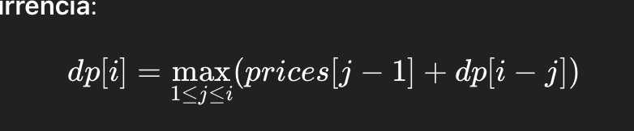
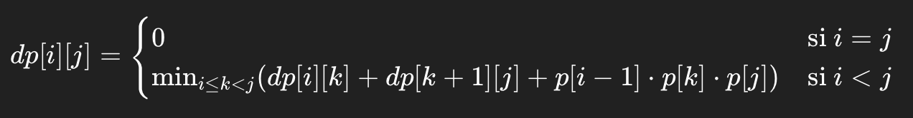
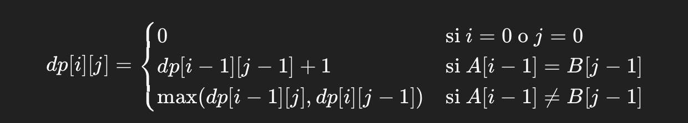
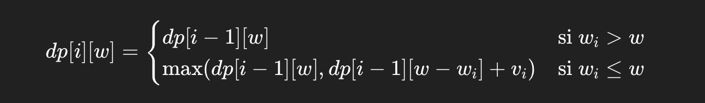

# Chapter 3: Algorithm Design

## Dynamic Programming

**Rod Cutting**

**Problem**: Given a rod of length `n` and an array `prices[]` where `prices[i]` represents the value of a rod of length `i + 1`, the goal is to find the best way to cut it to maximize profit.

**Recurrence relation**:

<div style="text-align: center;">
  
</div>


**Key concept**: for each length `i`, all possible cuts are evaluated, and the one that maximizes the sum between the value of the cut and the optimal solution of the remaining piece is selected.  
**Complexity**: O(n²)

---

**Matrix Chain Multiplication**

**Problem**: Given a sequence of matrices, determine the optimal multiplication order that minimizes the total number of scalar multiplications.  
**Input**: An array `p[]` such that the i-th matrix has dimensions `p[i-1] × p[i]`.

**Recurrence relation**:

<div style="text-align: center;">
  
</div>

**Strategy**: try all possible points `k` to split the product and take the minimum combination.  
**Complexity**: O(n³)

---

**Longest Common Subsequence (LCS)**

**Problem**: Given two strings, find the longest common subsequence (not necessarily contiguous).  
**Recurrence relation**:


<div style="text-align: center;">
  
</div>


**Strategy**: build a table that captures the length of the LCS for the first `i` and `j` characters of both strings.  
**Complexity**: O(m × n)

---

## Greedy Algorithms

**General Principles**
1. **Incremental construction**: the solution is built step by step.
2. **Local optimal decision**: at each step, choose the option that seems best without revisiting previous decisions.
3. **Optimality verification**: greedy algorithms do not always guarantee an optimal solution. It must be proven correct for the problem.

---

**Huffman Coding**

**Problem**: Given a set of characters and their frequencies, construct an optimal unambiguous binary code.

**Strategy**:
1. Create a node for each character.
2. Use a priority queue to build a binary tree by combining the two nodes with the lowest frequency.
3. Assign `0` to the left and `1` to the right when traversing the tree.

**Result**: shorter codes for more frequent characters, minimizing the total number of bits required.  
**Complexity**: O(n log n)

---

**The Knapsack Problem**

**Problem**: Given a set of items with weights and values, and a maximum capacity, select the items that maximize the total value without exceeding the capacity.

**Version 1 – Fractional (Greedy)**  
Fractions of items can be taken.  
**Strategy**: choose items with the highest value/weight ratio first.  
**Complexity**: O(n log n) (due to sorting)

**Version 2 – 0/1 (Dynamic Programming)**  
Items cannot be split.  
**Recurrence relation**:

<div style="text-align: center;">
  
</div>

Where `w_i` is the weight of item `i`, and `v_i` is its value.  
**Complexity**: O(n × W), where `W` is the total capacity.

---

## DP vs. Greedy Comparison

| Criterion             | Dynamic Programming            | Greedy Algorithm                         |
|-----------------------|--------------------------------|------------------------------------------|
| Repeated subproblems  | Yes                            | Not necessarily                          |d) | Only if proven |
| Typical example       | LCS, Rod Cutting, 0/1 Knapsack | Huffman, Fractional Knapsack, Activities |

---

## Other Algorithm Design Strategies

### 1. Divide and Conquer

**Main idea**:  
Divide the problem into smaller subproblems, solve them recursively, and then combine their solutions.

**Typical steps**:
1. **Divide** the problem into two or more subproblems of the same type.
2. **Conquer** each subproblem recursively.
3. **Combine** the solutions to obtain the solution to the original problem.

**Classic examples**:
- MergeSort
- QuickSort
- Binary Search
- Fast Fourier Transform

**Advantage**: reduces large problems to smaller, more manageable units.  
**Complexity**: often leads to recurrences like:

<div style="text-align: center;">
  
</div>

Where the **Master Theorem** can be used to solve them.

---

### 2. Backtracking

**Main idea**:  
Explore all possible solutions recursively, backtracking when a choice does not lead to a valid solution.

**Used when**:
- There are many possible combinations.
- We want to find all solutions or one that satisfies a condition.
- The search is complex and requires rollback.

**Examples**:
- N-Queens
- Sudoku
- Subsets that sum to a given value

**Technique**:
1. Move forward recursively in the solution space.
2. If a decision leads to an invalid solution, backtrack and try another option.

**Complexity**: Exponential in the worst case, but efficient with good pruning.

---

### 3. Branch and Bound

**Main idea**:  
Like backtracking, but uses a **bound function** to prune branches that cannot improve the current solution.

**Used in**:
- Optimization problems
- TSP (Traveling Salesman Problem)
- Knapsack

**Difference from backtracking**:
- Keeps track of the **best solution found so far**
- Computes a **lower or upper bound** to discard entire branches that can’t outperform the best

---

### 4. Randomized Algorithms

**Main idea**:  
Use random numbers to decide what to do in some steps of the algorithm.

**Types**:
- **Monte Carlo**: always fast, may return an incorrect answer with low probability.
- **Las Vegas**: always correct, but runtime may vary.

**Examples**:
- QuickSort (with random pivot)
- Primality algorithms (Miller-Rabin)
- Skip Lists

---

### 5. Dynamic Programming with Memoization (Top-Down)

In addition to the tabular (bottom-up) version, there’s a top-down version:
- The algorithm is written recursively.
- Each subproblem’s result is stored in a table (memoization).
- Avoids recomputing subproblems.

**Example**:

```java
Map<String, Integer> memo = new HashMap<>();

int fib(int n) {
    if (n <= 1) return n;
    String key = Integer.toString(n);
    if (memo.containsKey(key)) return memo.get(key);
    int result = fib(n - 1) + fib(n - 2);
    memo.put(key, result);
    return result;
}
````

---

### 6. Greedy + DP Combined

Some problems allow for hybrid strategies:

* First, apply a **greedy heuristic**.
* Then **verify** or **complete** the solution with dynamic programming.

**Example**: Approximation algorithms for graphs or NP-complete problems where the exact solution is too expensive.

---

## <span style="color:#94910ff;"><b>Strategy Comparison</b></span>

| Strategy           | Typical Use                        | Example                 | Typical Complexity        |
|--------------------|------------------------------------|-------------------------|---------------------------|
| Divide and Conquer | Recursive structured problems      | MergeSort, QuickSort    | O(n log n) or more        |
| Backtracking       | Exhaustive search with constraints | Sudoku, N-Queens        | Exponential               |
| Branch and Bound   | Optimization with pruning          | TSP, Knapsack           | Exponential (improved)    |
| Randomized         | Fast solutions, probabilistic      | QuickSort, Miller-Rabin | O(n log n), probabilistic |
| Memoization        | Repeated subproblems               | Fibonacci, LCS          | O(n·m)                    |

